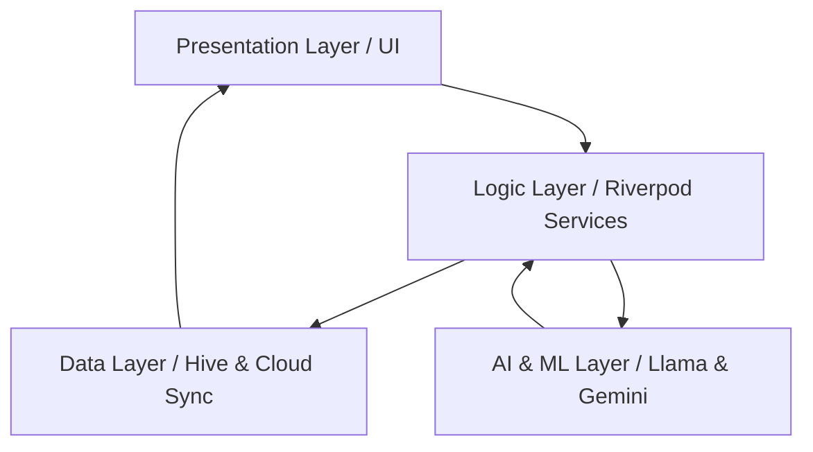

# 💰 EconomyApp (tAIdy)


---

## 🌍 Overview

**EconomyApp** is a modular and extensible personal finance management application designed to help users track, analyze, and understand their financial activity in a structured and intuitive way. The core objective of the project is to provide a clear and developer-friendly system for managing income, expenses, and financial trends over time, while also serving as a scalable foundation for more advanced features in the future.

Unlike many traditional finance tools that prioritize complexity and feature overload, EconomyApp focuses on **clarity, modularity, and transparency**. Every component of the system is designed to be understandable, adaptable, and easy to extend, making it suitable both for end users who want a simple tracking tool and for developers who want to study or build upon a real-world application architecture.

From a conceptual perspective, the application models financial behavior as a collection of structured transactions, each associated with metadata such as category, timestamp, and value. These transactions are then processed to generate insights, summaries, and trends, allowing users to make informed decisions about their spending habits.

The project is also intended as a learning platform. It demonstrates how to structure a real application, how to separate concerns between logic and presentation, and how to progressively scale a system from a basic prototype to a more production-ready solution. As such, clarity in both code and documentation is a primary goal.

## 📖 Deep Documentation
For those looking to dive deeper into our mechanics, view our specific architectural breakdowns:
- [🧭 tAIdy User Guide](docs/user_guide.md)
- [🤖 Integrating AI into tAIdy](docs/integrating_ai.md)

---

## 🎯 Purpose & Value Proposition

The primary purpose of EconomyApp is to simplify personal financial tracking while maintaining a clean and maintainable codebase. Many existing solutions either lack flexibility or are too complex for educational or lightweight use. EconomyApp fills this gap by providing a system that is both practical and instructive.

From a user perspective, the value lies in having a centralized place to:
* 🧾 Record financial transactions
* 📂 Categorize spending
* 📈 Observe trends over time
* 💡 Gain awareness of financial habits

From a developer perspective, the value is even more significant. The application is structured to demonstrate:
* 🏗️ Clean architectural separation
* 🚀 Scalable project organization
* 🧩 Reusable logic components
* 📊 Real-world data handling patterns

This dual-purpose design makes the project particularly strong as a portfolio piece. It is not just a tool, but also a demonstration of software engineering principles applied in a practical context.

In the long term, the project can evolve into a more advanced system, including predictive analytics, financial planning tools, and integration with external services. However, its foundation remains intentionally simple and understandable.

---

## 🚧 Project Status

EconomyApp is currently in an early development stage (**Beta**). Core functionalities are being designed and implemented, and the overall architecture is still evolving. At this stage, the project should be considered a working prototype rather than a finished product.

Some features may be incomplete or subject to change, and the internal structure may be refactored as the system grows. This is a natural part of the development process and reflects a focus on iterative improvement rather than premature optimization.

Despite being in development, the project already demonstrates key concepts such as transaction handling, Artificial Intelligence OCR data parsing, data organization, and modular design. These elements provide a strong foundation for future expansion.

Users and developers exploring the repository should approach it as both a functional prototype and a learning resource. Contributions, suggestions, and improvements are encouraged, as they can help guide the evolution of the project toward a more mature and robust application.

---

## ⚙️ Requirements

To work with EconomyApp effectively, a basic development environment must be set up. The project assumes familiarity with standard development tools and workflows.

### System Requirements
* A modern operating system (Windows, macOS, or Linux)
* A code editor (e.g., VS Code or Android Studio)
* Basic command-line knowledge

### Software Requirements
* **Flutter SDK** (version `^3.10.4` or higher recommended)
* **Dart SDK**
* Git for version control

These tools are necessary to install dependencies, run the application, and contribute to the codebase. Ensuring that your environment meets these requirements will prevent compatibility issues and allow for a smoother development experience.

---

## 📦 Installation

Installing EconomyApp is straightforward, but understanding each step is important to ensure proper setup and avoid common issues.

### Step 1: Clone the repository
This downloads the project locally so you can run and modify it.
```bash
git clone https://github.com/TheZen46/EconomyApp.git
cd EconomyApp
```

### Step 2: Install dependencies
This step installs all required Dart and Flutter libraries used by the application.
```bash
flutter pub get
```

### Step 3: Run the application
Depending on the current state of the project, you may start the app using:
```bash
flutter run
```

If the application is not yet fully runnable, this step may be partially implemented. In that case, the repository should be explored as a codebase rather than a finished product.

*Notes:*
* If errors occur, ensure Flutter is correctly installed by executing `flutter doctor` in your terminal.

---

## ▶️ Usage

EconomyApp is designed to simulate a typical financial tracking workflow. Even in its early stage, the intended usage flow can be described clearly.

### Basic Workflow
1. The user creates or records a financial transaction *(manually or via AI OCR)*.
2. Each transaction includes:
   * **Amount** (income or expense)
   * **Category** (e.g., food, transport, bills)
   * **Date or timestamp**
3. The system stores this data in a structured format (Encrypted eVault).
4. The application processes the data to generate summaries.
5. The user views insights such as:
   * Total expenses
   * Category distribution
   * Time-based trends

### Conceptual Example
A user spends €20 on food:
* Amount: `-20`
* Category: `Food`
* Result: The expense is added to the system and reflected in totals.

Over time, multiple entries create a dataset that can be analyzed for patterns and trends. The goal is not just recording data, but transforming it into meaningful information. This transformation is what gives the application its real value.

---

## 🏗️ Architecture

The architecture of EconomyApp is designed around separation of concerns using Riverpod, ensuring that each part of the system has a clear and specific responsibility.



### Core Layers

#### 1. Presentation Layer
Handles user interaction and display logic. This includes UI components and visual elements. Its role is to present data clearly without embedding business logic.

#### 2. Logic Layer
Contains the core functionality of the application. This includes:
* Transaction processing
* AI Text Extraction & Formatting
* Calculations and Data transformations

This layer is independent of the UI, making it reusable and easier to test.

#### 3. Data Layer
Responsible for storing and retrieving data. This may include:
* Local storage (Hive NoSQL)
* Databases (Supabase)
* Future API integrations

**Data Flow:**
`User Input → Processing Logic → Data Storage → Aggregation → UI Output`

This structured flow ensures that the system remains scalable and maintainable as new features are added.

---

## 🧩 Project Structure

The project is organized to reflect modern Flutter design practices, even if still evolving.

```text
/lib
  /core         → helper functions and foundational logic
  /features     → modularized logic based on domains
    /auth       → authentication flows
    /evault     → encrypted receipt storage logic
    /receipt_scanning  → UI and AI logic for tracking
```

### Explanation
* **features/**: Groups complex logic domains (like Scanning or Vaults) making scaling easy.
* **core/**: Provides small helper functions, base API services, and utilities used across the project.

This structure improves readability, maintainability, and scalability.

---

## 📊 Data Model

The core of the application is the transaction model.

### Transaction Object
* **id**: Unique identifier
* **amount**: Numeric value (positive or negative)
* **category**: Type of transaction
* **date**: Timestamp of the transaction

This simple structure allows for flexible analysis and easy expansion. Additional fields (such as notes or tags) can be added without disrupting the system.

---

## 🧭 Roadmap

The future of EconomyApp includes several planned improvements:
- [ ] Advanced analytics and charts
- [ ] User authentication
- [ ] Data persistence with a database
- [ ] Export functionality (CSV, JSON)
- [ ] Predictive financial insights

The roadmap reflects a gradual transition from prototype to full application.

---

## 🤝 Contributing

Contributions are welcome and encouraged. This project is designed to grow and improve over time.

### Guidelines
* Keep code clean and readable.
* Follow existing structure and naming conventions.
* Document new features clearly.
* Open issues before major changes.

Collaboration is an essential part of building robust software, and contributions help improve both functionality and quality.

---

## 📄 License

This project is released under the **MIT License**.

This means you are free to use, modify, and distribute the software, provided that proper credit is given. **This project has been done in a big part with human code made by TheZen46.**

---

## 🧠 Final Note

EconomyApp is more than just a tool—it is a structured exploration of how financial systems can be modeled, implemented, and scaled. Its true strength lies not only in what it does, but in how it is built.

The clarity of its architecture, the simplicity of its data model, and the intentional design choices make it a strong foundation for both learning and development.
