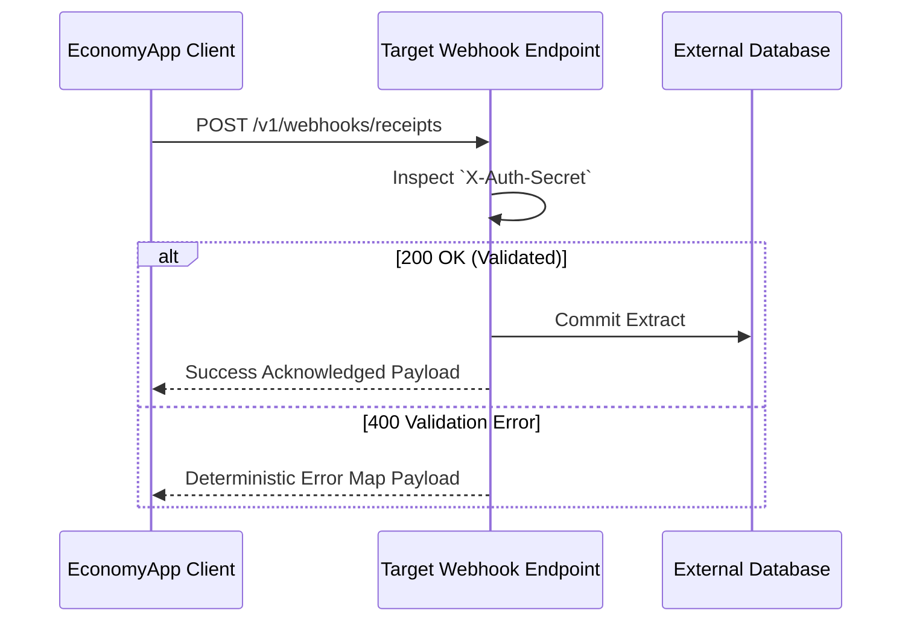

# 📡 The "Strict Contract" Protocol (Webhook API)

EconomyApp bridges data outwards utilizing robust, authenticated Webwebhook Services allowing you to ping isolated Enterprise Resource Systems (ERPs) or simple external analytics databases. The API logic behaves deterministically across "happy" and "sad" path conditions.



---

### `POST` `/v1/webhooks/receipts`
**Purpose:** *Push an AI-parsed structured receipt payload sequentially to an aggregated external target.*

#### 1. Authentication
* **Required:** Yes
* **Method:** Custom Environment Header Binding. Set externally via EconomyApp's frontend UI, integrated statically as the `X-Auth-Secret` within the header pipeline.

#### 2. Request Parameters
*The below parameters designate precisely the JSON expected format passed upwards.*

| Field | Type | Required | Description | Constraints |
| :--- | :--- | :--- | :--- | :--- |
| `transactionId` | String | Yes | Unique hash denoting the specific scan. | Strict UUID `v4` formulation. |
| `merchantName` | String | Yes | Name of the institution extracted via AI. | Min 2, Max 255 chars. |
| `totalAmount` | Float | Yes | Aggregate receipt value calculated. | Numeric greater than `0.00`. |
| `currency` | String | Yes | Underlying fiat processing scale. | Exactly 3 uppercase parameters (`USD`, `EUR`). |
| `items` | Array | No | Specific lines extracted referencing physical items. | An array of bound Objects (`description`, `price`). |

#### 3. Request Example
*Observe the clean cURL implementation structure.*
```bash
curl -X POST https://api.externalsoftware.com/v1/webhooks/receipts \
     -H "X-Auth-Secret: super_secret_app_key_38f29" \
     -H "Content-Type: application/json" \
     -d '{"transactionId": "f47ac10b-58cc-4372-a567-0e02b2c3d479", "merchantName": "Walmart", "totalAmount": 45.22, "currency": "USD"}'
```

#### 4. Response Codes & Payloads
*The application monitors specifically for exactly formatted REST responses.*

**✅ 200 OK (Success Flow)**
*The Webhook ping successfully reached the endpoint and external modifications were registered.*
```json
{
  "status": "success",
  "data": {
    "synchedAt": "2026-04-04T12:00:23Z",
    "externalReferenceId": "A93F-11K",
    "queued": true
  }
}
```

**❌ 401 Unauthorized (Auth Flow)**
*The `X-Auth-Secret` attached to the POST header pipeline did not mathematically align with expected endpoint parameters.*
```json
{
  "status": "error",
  "code": "INVALID_SECRET_AUTHORITY",
  "message": "The X-Auth-Secret provided does not functionally match the designated endpoint."
}
```

**❌ 400 Bad Request (Validation Flow)**
*Structural elements in the JSON request schema violated constraints.*
```json
{
  "status": "error",
  "code": "MALFORMED_CURRENCY_CONSTRAINT",
  "message": "The currency field is constrained to exactly 3 uppercase letters ensuring correct fiat exchange algorithms."
}
```

---
> 💡 *Pro-Tip: We highly recommend leveraging OpenAPI Specs (formerly Swagger) natively tied to the host webhook endpoint to seamlessly guarantee response payloads remain flawlessly in synchronization with codebase alterations over time.*
