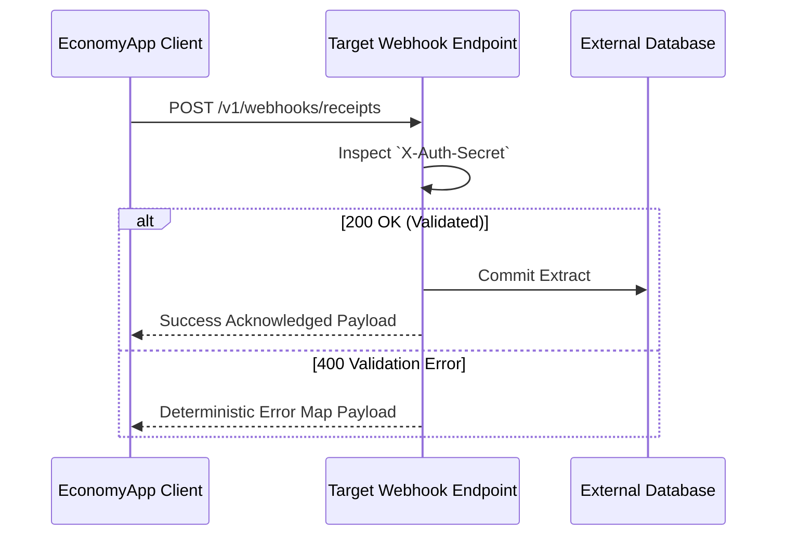

# 📡 The "Strict Contract" Protocol (Webhook API)

EconomyApp bridges data outwards utilizing robust, authenticated Webwebhook Services allowing you to ping isolated Enterprise Resource Systems (ERPs) or simple external analytics databases. The API logic behaves deterministically across "happy" and "sad" path conditions.



---

### `POST` `/v1/webhooks/receipts`
**Purpose:** *Push an AI-parsed structured receipt payload sequentially to an aggregated external target.*

#### 1. Authentication
* **Required:** Yes
* **Method:** Custom Environment Header Binding. Set externally via EconomyApp's frontend UI, integrated statically as the `X-Auth-Secret` within the header pipeline.

#### 2. Request Parameters
*The below parameters designate precisely the JSON expected format passed upwards.*

| Field | Type | Required | Description | Constraints |
| :--- | :--- | :--- | :--- | :--- |
| `transactionId` | String | Yes | Unique hash denoting the specific scan. | Strict UUID `v4` formulation. |
| `merchantName` | String | Yes | Name of the institution extracted via AI. | Min 2, Max 255 chars. |
| `totalAmount` | Float | Yes | Aggregate receipt value calculated. | Numeric greater than `0.00`. |
| `currency` | String | Yes | Underlying fiat processing scale. | Exactly 3 uppercase parameters (`USD`, `EUR`). |
| `items` | Array | No | Specific lines extracted referencing physical items. | An array of bound Objects (`description`, `price`). |

#### 3. Request Example
*Observe the clean cURL implementation structure.*
```bash
curl -X POST https://api.externalsoftware.com/v1/webhooks/receipts \
     -H "X-Auth-Secret: super_secret_app_key_38f29" \
     -H "Content-Type: application/json" \
     -d '{"transactionId": "f47ac10b-58cc-4372-a567-0e02b2c3d479", "merchantName": "Walmart", "totalAmount": 45.22, "currency": "USD"}'
```

#### 4. Response Codes & Payloads
*The application monitors specifically for exactly formatted REST responses.*

**✅ 200 OK (Success Flow)**
*The Webhook ping successfully reached the endpoint and external modifications were registered.*
```json
{
  "status": "success",
  "data": {
    "synchedAt": "2026-04-04T12:00:23Z",
    "externalReferenceId": "A93F-11K",
    "queued": true
  }
}
```

**❌ 401 Unauthorized (Auth Flow)**
*The `X-Auth-Secret` attached to the POST header pipeline did not mathematically align with expected endpoint parameters.*
```json
{
  "status": "error",
  "code": "INVALID_SECRET_AUTHORITY",
  "message": "The X-Auth-Secret provided does not functionally match the designated endpoint."
}
```

**❌ 400 Bad Request (Validation Flow)**
*Structural elements in the JSON request schema violated constraints.*
```json
{
  "status": "error",
  "code": "MALFORMED_CURRENCY_CONSTRAINT",
  "message": "The currency field is constrained to exactly 3 uppercase letters ensuring correct fiat exchange algorithms."
}
```

---

# ☁️ Cloud Replication & Multi-Device Parity API Contract

The tAIdy Cross-Device File Synchronization Engine interacts with Supabase Storage and PostgreSQL endpoints to guarantee bit-for-bit parity across devices.

## 1. Remote File Directory Layout (Supabase Storage: `receipts` bucket)

```
receipts/
└── training_data/
    └── <userId>/
        ├── images/
        │   ├── <receiptId>.jpg
        │   └── <receiptId>.png
        └── labels/
            ├── <receiptId>.json
            └── <receiptId>_ocr.json
```

### Storage Security & Row-Level Security (RLS) Policy
- **Upload / Read Prefix**: `training_data/<userId>/` or `<userId>/`
- **RLS Guard**: Operations are scoped to authenticated users matching `(storage.foldername(name))[2] = auth.uid()::text` or user-owned subfolders.
- **Payload Streaming**: Binary files are uploaded and downloaded via standard chunked streams (`uploadBinary` / HTTP GET), supporting cross-platform web and mobile environments.

---

## 2. Remote Database Schema & Parity Contracts

The client sync engine synchronizes structured entities bidirectionally across five PostgreSQL tables:

### 1. `receipts`
| Column | Type | Nullable | Description |
| :--- | :--- | :--- | :--- |
| `id` | `TEXT` / `UUID` | No | Primary key, matches client receipt ID |
| `user_id` | `UUID` | No | Foreign key referencing `auth.users(id)` |
| `merchant_name` | `TEXT` | No | Extracted merchant name |
| `total_amount` | `NUMERIC` | No | Total calculated receipt cost |
| `date` | `TIMESTAMPTZ` | No | Transaction ISO timestamp |
| `currency` | `TEXT` | No | ISO 4217 Currency Code (e.g. `USD`, `EUR`) |
| `items` | `JSONB` | Yes | Serialized list of `ReceiptItem` objects |
| `image_path` | `TEXT` | Yes | Relative or storage URI to receipt image |
| `created_at` | `TIMESTAMPTZ` | Yes | Record creation timestamp |

> **Note on PGRST204 Graceful Degradation**: If the backend database schema has not yet applied the `image_path` migration, `SyncService` catches the Postgrest notice `PGRST204` without aborting the transaction sync queue.

### 2. `boxes`
| Column | Type | Nullable | Description |
| :--- | :--- | :--- | :--- |
| `id` | `TEXT` | No | Unique box identifier (e.g. `main`, `box_xxx`) |
| `user_id` | `UUID` | No | Owner UUID |
| `name` | `TEXT` | No | Box name (e.g. `Travel`, `Office`) |
| `budget` | `NUMERIC` | No | Allocated budget limit |
| `spent` | `NUMERIC` | No | Current spent aggregate |
| `currency` | `TEXT` | No | Currency denomination |
| `color` | `INTEGER` | Yes | 32-bit ARGB color integer value |
| `icon` | `TEXT` | Yes | Icon identifier name |
| `is_private` | `BOOLEAN` | Yes | Privacy isolation flag |

### 3. `assets` (eVault Protected Items)
| Column | Type | Nullable | Description |
| :--- | :--- | :--- | :--- |
| `id` | `TEXT` | No | Unique asset identifier |
| `user_id` | `UUID` | No | Owner UUID |
| `name` | `TEXT` | No | Protected item name (e.g. `MacBook Pro`) |
| `merchant_name` | `TEXT` | Yes | Purchasing merchant |
| `price` | `NUMERIC` | No | Purchase price |
| `warranty_expiry_date` | `TIMESTAMPTZ` | Yes | Warranty expiration timestamp |
| `receipt_image_path` | `TEXT` | Yes | Evidentiary image location |

### 4. `invoices`
| Column | Type | Nullable | Description |
| :--- | :--- | :--- | :--- |
| `id` | `TEXT` | No | Unique invoice UUID |
| `user_id` | `UUID` | No | Owner UUID |
| `invoice_number` | `TEXT` | No | Display invoice code (e.g. `INV-2026-001`) |
| `client_name` | `TEXT` | No | Client or enterprise name |
| `amount` | `NUMERIC` | No | Total billed amount |
| `status` | `TEXT` | No | Status string: `draft`, `sent`, `settled`, `overdue` |
| `issued_date` | `TIMESTAMPTZ` | No | Issuance date |
| `due_date` | `TIMESTAMPTZ` | Yes | Due date |
| `currency` | `TEXT` | No | Currency code |

---

## 3. Delta Parity Algorithm & Checksums

1. **Manifest Query**: Client issues parallel queries to `RemoteReplicaDataSource` fetching entity IDs, timestamps, and storage metadata (`size`, `updated_at`, `id`).
2. **Local Cache Inspection**: The local Hive boxes and file directories compute existing object checksums.
3. **Delta Calculation**:
   $$\Delta = \text{RemoteManifest} \setminus \text{LocalManifest}$$
4. **Hydration & Asset Streaming**: Only items in $\Delta$ are streamed over the network and rehydrated into encrypted local storage.

