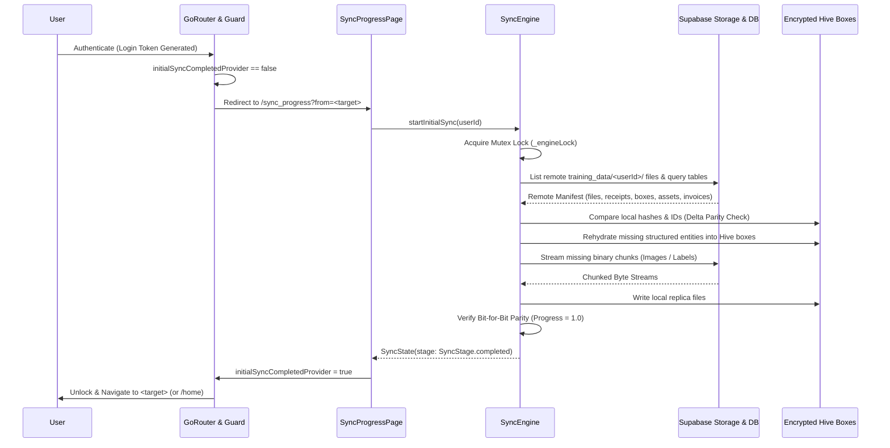

# Technical Documentation: Architecture, Security, and Core Subsystems

## 1. System Overview

This document provides a comprehensive technical overview of the architectural hardening, cryptographic security, fault-tolerant persistence, biometric access control, LLM response normalization, and routing infrastructure implemented in the application.

The key systems and components include:

* **Authentication & Reactive Routing Subsystem**: Native Supabase session management integrated with `GoRouter` using a custom `RouterNotifier` attached to `onAuthStateChange` streams and `initialSyncCompletedProvider` to enforce declarative route guards and deep link preservation.
* **Cross-Device File Synchronization Engine**: `SyncEngine` and `RemoteReplicaDataSource` guaranteeing bit-for-bit file replication from cloud storage directories (`training_data/<userId>/images` & `labels`) and schema hydration into encrypted Hive boxes (`receipts`, `boxes`, `assets`, `invoices`, `taxonomies`) with mutex locking, delta parity checking, and exponential backoff retry.
* **Kinetic UI Subsystem & Live Telemetry**: `KineticSyncProgressBar` and `SyncProgressPage` providing dynamic shader-driven energy waves, glowing aura leading edges, orbital geometric accents, and live JetBrains Mono telemetry metrics (bandwidth, data volume, delta object counts, countdown ETA).
* **Cryptographic & Secure Storage Infrastructure**: `SecureStorageService` leveraging platform-native keychains (`EncryptedSharedPreferences` on Android, Apple Keychain on iOS) to manage 256-bit AES encryption keys for Hive NoSQL storage and sensitive API secrets.
* **Fault-Tolerant Storage & Migration Layer**: `HiveMigrationService` with automatic pre-corruption filesystem snapshots, custom exception hierarchies (`SchemaCorruptionException`), and an emergency recovery UI (`_DataRecoveryApp`) preventing silent data loss.
* **Biometric Application Guard**: An application-level lifecycle observer (`BiometricGuard` and `BiometricService`) utilizing `local_auth` to lock view hierarchies and re-authenticate sessions upon background/foreground state transitions.
* **Deterministic LLM Output Parsing Engine**: `JsonParserUtils`, a three-tier extraction engine handling unformatted, conversational, markdown-fenced, or malformed JSON payloads from edge and cloud inference models.
* **Global Error Boundaries & Isolation**: Runtime configuration of `FlutterError.onError` and `PlatformDispatcher.instance.onError` to intercept unhandled asynchronous exceptions and isolate crashes.

---

## 2. Component Breakdown

### 2.1 Cryptographic Storage & Key Lifecycle (`SecureStorageService`)

The `SecureStorageService` manages access to platform-level hardware-backed keychains. It decouples high-throughput local NoSQL operations from secret storage while ensuring database files on disk are fully encrypted with AES-256.

```dart
class SecureStorageService {
  static const _hiveEncryptionKeyName = 'taidy_hive_encryption_key';
  static const FlutterSecureStorage _storage = FlutterSecureStorage(
    aOptions: AndroidOptions(encryptedSharedPreferences: true),
    iOptions: IOSOptions(accessibility: KeychainAccessibility.first_unlock_this_device),
  );

  static Future<Uint8List> getHiveEncryptionKey() async {
    final existing = await _storage.read(key: _hiveEncryptionKeyName);
    if (existing != null) {
      return base64Url.decode(existing);
    }
    final key = Hive.generateSecureKey();
    final encoded = base64Url.encode(key);
    await _storage.write(key: _hiveEncryptionKeyName, value: encoded);
    return Uint8List.fromList(key);
  }

  static Future<String?> readSecret(String key) async => await _storage.read(key: key);
  static Future<void> writeSecret(String key, String value) async => await _storage.write(key: key, value: value);
  static Future<void> deleteSecret(String key) async => await _storage.delete(key: key);
}
```

* **Key Mechanics**: On the initial cold start, `getHiveEncryptionKey()` generates a cryptographically secure 256-bit array via `Hive.generateSecureKey()`, serializes it via URL-safe Base64, and persists it into the platform keystore. Subsequent boots read and decode the key into memory to instantiate `HiveAesCipher`.
* **Platform Hardening**: Configured with `encryptedSharedPreferences: true` for Android Keystore integration and `KeychainAccessibility.first_unlock_this_device` for iOS, preventing key access while the device remains in a locked pre-boot state.

---

### 2.2 Non-Destructive Persistence Engine (`HiveMigrationService`)

To eliminate catastrophic data loss caused by schema mismatch, corrupted box headers, or cryptographic key desynchronization, `HiveMigrationService` wraps Hive's low-level box opening mechanism with a non-destructive filesystem snapshot routine.

```dart
class HiveMigrationService {
  static Future<Box<T>> openBoxSafe<T>(
    String boxName, {
    HiveCipher? encryptionCipher,
  }) async {
    try {
      return await Hive.openBox<T>(
        boxName,
        encryptionCipher: encryptionCipher,
      );
    } catch (e) {
      debugPrint('HiveMigrationService: Failed to open "$boxName": $e');
      final backupPath = await _backupBoxFile(boxName);
      throw SchemaCorruptionException(
        boxName: boxName,
        cause: e,
        backupPath: backupPath,
      );
    }
  }

  static Future<String?> _backupBoxFile(String boxName) async {
    try {
      final dir = await _getHiveDirectory();
      final sourceFile = File('${dir.path}/$boxName.hive');
      if (!await sourceFile.exists()) return null;

      final timestamp = DateTime.now()
          .toIso8601String()
          .replaceAll(':', '-')
          .replaceAll('.', '-');
      final backupFile = File('${dir.path}/${boxName}_backup_$timestamp.hive');

      await sourceFile.copy(backupFile.path);
      return backupFile.path;
    } catch (backupError) {
      return null;
    }
  }
}
```

* **Execution Flow**: If `Hive.openBox<T>` throws an exception (e.g., incompatible type IDs, malformed binary payloads), execution is intercepted. The underlying `.hive` binary file is copied to a timestamped target before any compaction or clearing logic is invoked.
* **Failure Signaling**: Throws a specialized `SchemaCorruptionException` carrying the absolute backup URI, enabling higher layers to isolate the failure and offer manual recovery paths.

---

### 2.3 Reactive Authentication State Machine (`AuthNotifier` & `RouterNotifier`)

Authentication state is managed via an asynchronous event-driven state notifier synchronized with Supabase's authentication stream.

```dart
class AuthNotifier extends StateNotifier<AuthState> {
  final SupabaseClient _client;

  AuthNotifier(this._client) : super(const AuthState()) {
    _initialize();
  }

  void _initialize() {
    final session = _client.auth.currentSession;
    state = session != null
        ? AuthState(status: AuthStatus.authenticated, user: _client.auth.currentUser)
        : const AuthState(status: AuthStatus.unauthenticated);

    _client.auth.onAuthStateChange.listen((data) {
      switch (data.event) {
        case AuthChangeEvent.signedIn:
        case AuthChangeEvent.tokenRefreshed:
        case AuthChangeEvent.userUpdated:
          state = AuthState(status: AuthStatus.authenticated, user: data.session?.user);
          break;
        case AuthChangeEvent.signedOut:
          state = const AuthState(status: AuthStatus.unauthenticated);
          break;
        default:
          break;
      }
    });
  }
}

class RouterNotifier extends ChangeNotifier {
  RouterNotifier(Ref ref) {
    ref.listen<AsyncValue<AuthChangeEvent>>(
      authStateStreamProvider,
      (_, __) => notifyListeners(),
    );
  }
}
```

* **Routing Synchronization**: `RouterNotifier` consumes `authStateStreamProvider` and invokes `notifyListeners()` on state transitions. This triggers `GoRouter.refreshListenable`, forcing re-evaluation of route guards without requiring widget rebuilds or manual route navigation.

---

### 2.4 Application Lifecycle Biometric Interceptor (`BiometricGuard`)

The `BiometricGuard` widget wraps the root navigation hierarchy, monitoring OS-level application lifecycle states to enforce biometric re-authentication when resuming from inactive or background execution.

```dart
class _BiometricGuardState extends ConsumerState<BiometricGuard> with WidgetsBindingObserver {
  bool _isAuthenticated = false;
  bool _isAuthenticating = false;

  @override
  void didChangeAppLifecycleState(AppLifecycleState state) {
    if (state == AppLifecycleState.paused ||
        state == AppLifecycleState.inactive ||
        state == AppLifecycleState.hidden) {
      _handlePause();
    } else if (state == AppLifecycleState.resumed) {
      _handleResume();
    }
  }

  void _handlePause() {
    if (!ref.read(biometricEnabledProvider)) return;
    if (mounted && _isAuthenticated) {
      setState(() {
        _isAuthenticated = false;
      });
    }
  }

  void _handleResume() {
    if (!ref.read(biometricEnabledProvider)) return;
    if (mounted && !_isAuthenticated && !_isAuthenticating) {
      _authenticate();
    }
  }
}
```

* **State Isolation**: When the OS transitions the app to `paused` or `inactive`, `_isAuthenticated` resets to `false`. On `resumed`, the interface presents a modal lock screen blocking view trees until `LocalAuthentication.authenticate()` completes successfully.

---

### 2.5 Multi-Tier JSON Extraction Engine (`JsonParserUtils`)

Edge and cloud LLMs frequently emit responses containing conversational text, markdown tags, or escaped quotes that invalidate standard `jsonDecode`. `JsonParserUtils` employs three successive parsing strategies to deterministically isolate valid JSON objects.

```dart
class JsonParserUtils {
  static Map<String, dynamic>? extractJsonMap(String response) {
    final jsonString = extractJsonBlock(response);
    if (jsonString == null) return null;
    try {
      final decoded = jsonDecode(jsonString);
      return decoded is Map<String, dynamic> ? decoded : null;
    } catch (_) {
      return null;
    }
  }

  static String? extractJsonBlock(String response) {
    if (response.trim().isEmpty) return null;

    // Strategy 1: Fenced markdown blocks
    final fencedMatch = RegExp(r'```(?:json)?\s*(\{[\s\S]*?\})\s*```', multiLine: true)
        .firstMatch(response);
    if (fencedMatch != null) {
      final candidate = fencedMatch.group(1)!.trim();
      if (_isValidJson(candidate)) return candidate;
    }

    // Strategy 2: State-machine depth counter for balanced braces
    final balanced = _extractBalancedBraces(response);
    if (balanced != null && _isValidJson(balanced)) return balanced;

    // Strategy 3: Greedy substring bounded by outermost braces
    final start = response.indexOf('{');
    final end = response.lastIndexOf('}');
    if (start != -1 && end > start) {
      return response.substring(start, end + 1).trim();
    }

    return null;
  }
}
```

* **Depth Counter Logic**: `_extractBalancedBraces` iterates through character indices, tracking string escape characters (`\`) and quotation boundaries (`"`). This ensures nested JSON objects or brace characters within string values do not terminate parsing prematurely.

---

### 2.6 Cross-Device File Synchronization Engine (`SyncEngine` & `RemoteReplicaDataSource`)

The `SyncEngine` provides a robust, cross-device data replication subsystem that downloads a full bit-for-bit replica of the user's remote files and structured data entities immediately upon login, performs delta synchronization, and streams chunked binary assets with exponential backoff resiliency.



```dart
class SyncEngine {
  final RemoteReplicaDataSource remoteDataSource;
  final LocalReceiptDataSource localDataSource;
  final Box<AssetModel>? assetsBox;
  final Box<BoxModel>? boxesBox;
  final Box<InvoiceModel>? invoicesBox;
  final Box<TaxonomyConfigModel>? taxonomyBox;
  final SyncService? uploadSyncService;

  final Lock _engineLock = Lock();
  final math.Random _random = math.Random();
  SyncProgressState _currentState = const SyncProgressState();

  Future<bool> executeSync({
    required String userId,
    bool isInitial = false,
    int maxRetries = 3,
  }) async {
    return await _engineLock.synchronized(() async {
      // 1. Handshake & Connectivity Verification
      // 2. Discover Remote Manifest (tables + storage)
      // 3. Compute Delta Checksums
      // 4. Hydrate Structured Entities into Local Hive Boxes
      // 5. Stream Delta Binary Assets with Resilient Chunks
      // 6. Verify Bit-for-Bit Parity
    });
  }
}
```

* **Data Replication & Delta Parity**: Replicates entire remote directories (`training_data/<userId>/images` and `training_data/<userId>/labels`) and PostgreSQL entities (`receipts`, `boxes`, `assets`, `invoices`, `taxonomies`). Skips local assets whose IDs, timestamps, or byte sizes match the remote manifest, ensuring minimal bandwidth consumption.
* **Concurrency & Race Condition Elimination**: Employs an internal async mutex `Lock()` (`_engineLock`) to serialize sync passes. Multiple concurrent triggers from UI toggles or connectivity recovery queue behind the active synchronization run rather than executing in parallel.
* **Network Interruption & Exponential Backoff**: Subscribes to `connectivity_plus` to automatically pause downloads on network drops. When an individual chunk fails, the engine retries using an exponential backoff formula with randomized jitter:
  $$\text{Delay}(n) = 2^n + \text{jitter}_{0..1000\text{ms}}$$
* **Zero-Downtime Offline Fallback**: Exposes `continueOffline()` which marks the initial sync as bypassed, enabling full local workspace interaction when remote cloud endpoints are unreachable.

---

### 2.7 Kinetic Visualizer & Live Telemetry Subsystem (`KineticSyncProgressBar` & `SyncProgressPage`)

The visual synchronization interface adheres to the tAIdy International Klein Blue (IKB) design language, providing immersive feedback through custom shader painting, glowing edge lighting, and live telemetry data.

```dart
class KineticSyncProgressBar extends StatefulWidget {
  final double progress; // 0.0 to 1.0
  final double speedBytesPerSec;
  final String formattedBytes;
  final String formattedSpeed;
  final String formattedEta;
  final bool isRetrying;
  final bool isIndeterminate;
  // ...
}
```

* **Custom Kinetic Energy Wave**: Rendered via a dedicated `CustomPainter` (`_KineticProgressPainter`) with hardware-accelerated gradient shaders, glowing leading edge auras (`MaskFilter.blur(BlurStyle.normal, 8.0)`), and orbiting geometric accents.
* **Dynamic Rotating Prompts**: Employs an animated text sequencer cycling through context-specific operational states (e.g., *"Establishing Quantum Session Link"*, *"Resolving Delta Manifest"*, *"Decrypting Binary Chunks"*, *"Validating Checksums"*, *"Synchronizing Neural Weights"*).
* **High-Precision Telemetry Grid**: Displays 4 responsive metric cards rendered in JetBrains Mono:
  1. **Data Replicated**: Live transferred bytes / total payload size (e.g., `12.4 MB / 14.8 MB`).
  2. **Delta Objects**: Remaining vs. total files and records (e.g., `8 / 12 Objects`).
  3. **Bandwidth Rate**: Instantaneous throughput calculated via rolling window timestamps (e.g., `2.4 MB/s`).
  4. **Estimated Time**: Dynamic ETA countdown calculated as $\frac{\text{Bytes Remaining}}{\text{Transfer Rate}}$.

---

### 2.8 Post-Login State Blocking & Deep Link Preservation (`app_router.dart`)

To prevent users from interacting with incomplete or stale local datasets prior to completing initial cloud replication, `app_router.dart` implements a strict post-login barrier.

```dart
// Centralized GoRouter redirect guard
redirect: (context, state) {
  final authState = ref.read(authProvider);
  final initialSyncDone = ref.read(initialSyncCompletedProvider);
  final isAuthenticated = authState.isAuthenticated;
  final loc = state.matchedLocation;
  final isSyncing = loc == AppRoutes.syncProgress;

  // 1. Unauthenticated -> redirect to /login preserving deep link
  if (!isAuthenticated && !isPublicRoute(loc)) {
    return '${AppRoutes.login}?from=${Uri.encodeComponent(state.uri.toString())}';
  }

  // 2. Authenticated but initial sync pending -> redirect to /sync_progress preserving deep link
  if (isAuthenticated && !initialSyncDone && !isSyncing) {
    final from = state.uri.queryParameters['from'] ?? state.uri.toString();
    return '${AppRoutes.syncProgress}?from=${Uri.encodeComponent(from)}';
  }

  // 3. Authenticated and sync completed -> route to preserved target or /home
  if (isAuthenticated && isSyncing && initialSyncDone) {
    final from = state.uri.queryParameters['from'];
    if (from != null && from.isNotEmpty && from != AppRoutes.syncProgress) {
      return from;
    }
    return AppRoutes.home;
  }

  return null; // Route allowed
}
```

* **Deep Link Preservation**: Preserves the original deep link target (`/vault`, `/boxes`, `/invoices`, etc.) throughout authentication and synchronization sequences. Once `initialSyncCompletedProvider` transitions to `true`, `RouterNotifier` reactively evaluates the redirect and navigates directly to the requested screen.

---

## 3. Implementation Analysis

### 3.1 Bootstrap Initialization Pipeline (`main.dart`)

```
+-------------------------------------------------------------+
|               WidgetsFlutterBinding Initialized             |
+-------------------------------------------------------------+
                              |
+-------------------------------------------------------------+
| Attach Global Handlers: FlutterError & PlatformDispatcher   |
+-------------------------------------------------------------+
                              |
+-------------------------------------------------------------+
| Load .env (SUPABASE_URL, SUPABASE_ANON_KEY)                 |
+-------------------------------------------------------------+
                              |
+-------------------------------------------------------------+
| Initialize Supabase Client with Persisted Session Tokens   |
+-------------------------------------------------------------+
                              |
+-------------------------------------------------------------+
| Retrieve / Generate 256-bit AES Key via SecureStorageService|
+-------------------------------------------------------------+
                              |
+-------------------------------------------------------------+
| Open Encrypted Hive Boxes via HiveMigrationService          |
| (Receipts, SyncQueue, Assets, Boxes, Invoices)              |
+-------------------------------------------------------------+
           |                                     |
    [Open Success]                       [Schema Exception]
           |                                     |
+----------------------+             +------------------------+
| Migrate Old Secrets  |             | Launch Emergency       |
| to Secure Storage    |             | _DataRecoveryApp Shell |
+----------------------+             +------------------------+
           |
+-------------------------------------------------------------+
| Execute runApp(ProviderScope -> BiometricGuard -> Router)   |
+-------------------------------------------------------------+
```

* **Function**: Orchestrates application bootstrapping, dependency injection, and security layer establishment.
* **Input / Output Flow**: Consumes `.env` configuration, platform keystore keys, and local SQLite/Hive binaries. Outputs a configured `ProviderScope` containing pre-warmed Hive boxes and initialized clients.
* **State Mutations**:
  * Registers 10 binary Hive adapters in memory.
  * Mutates `settingsBox` by extracting legacy plaintext keys (`gemini_api_key`, `webhook_secret`, `webhook_url`) and persisting them into `FlutterSecureStorage`.
  * Overrides Riverpod providers (`hiveBoxProvider`, `settingsBoxProvider`, `syncBoxProvider`, `assetsBoxProvider`, `themeProvider`) with initialized instances.

---

### 3.2 Guarded Routing Engine (`app_router.dart`)

* **Function**: Evaluates application route permissions dynamically across public, authenticated, and guarded states.
* **Input / Output Flow**:
  * Input: `state.matchedLocation`, `authProvider.status`, `authProvider.isAuthenticated`.
  * Output: String path redirect (`/`, `/home`, or `null`).
* **State Mutations**: None (pure evaluation function based on reactive Riverpod state).
* **Decision Matrix**:
  * If `AuthStatus == unknown` and route is protected: Redirect to `/` (Login).
  * If `isAuthenticated == false` and target is not in `_publicRoutes`: Redirect to `/`.
  * If `isAuthenticated == true` and target is in `_publicRoutes`: Redirect to `/home`.
  * All other conditions: Return `null` (allow route transition).

---

### 3.3 Authentication Provider (`auth_provider.dart`)

* **Function**: Encapsulates Supabase Auth API calls, manages loading state, and transforms native SDK exceptions into structured errors.
* **State Transitions**:
  * Initial: `AuthState(status: AuthStatus.unknown, isLoading: false)`
  * Request Start: `state.copyWith(isLoading: true, errorMessage: null)`
  * Success: `AuthState(status: AuthStatus.authenticated, user: User, isLoading: false)`
  * Failure: `state.copyWith(isLoading: false, errorMessage: e.message)`
  * Logout: `AuthState(status: AuthStatus.unauthenticated, user: null, isLoading: false)`

---

## 4. Architectural Decision Records (ADR)

### ADR 001: Separation of Relational Session Auth (Supabase) and Encrypted NoSQL Local Storage (Hive + AES)

* **Context**: The application requires real-time cloud synchronization and multi-device auth, but also high-throughput offline-first operations for invoice OCR processing and dashboard metrics.
* **Decision**: Adopt Supabase for user authentication and remote synchronization, while maintaining local data storage within Hive NoSQL boxes encrypted via `HiveAesCipher` using keys sourced from `FlutterSecureStorage`.
* **Rationale**:
  * Supabase provides secure JWT rotation, email verification, and OAuth integrations natively.
  * Hive provides synchronous read access and low CPU overhead on mobile devices compared to continuous SQLite relational queries.
  * Encrypting Hive boxes via hardware-backed AES keys guarantees that locally stored financial data is unreadable if the physical device file system is inspected.
* **Alternatives Considered & Discarded**:
  * *Pure SQLite (sqflite/drift)*: Discarded due to increased boilerplate and performance overhead when serializing/deserializing deeply nested receipt items during live OCR parsing.
  * *Pure Supabase (No local database)*: Discarded due to lack of complete offline capabilities and network latency during rapid scanning workflows.

---

### ADR 002: Non-Destructive Snapshot on Box Corruption vs. Automatic Database Reset

* **Context**: Schema evolutions (e.g., adding fields to `ReceiptModel` without strict adapter versioning) or encryption key mismatches can cause Hive initialization to throw runtime exceptions. Standard community patterns often invoke `Hive.deleteBoxFromDisk()`, resulting in unrecoverable user data loss.
* **Decision**: Implement `HiveMigrationService.openBoxSafe()` which creates a physical timestamped backup of the `.hive` file before propagating a `SchemaCorruptionException`, terminating startup into a standalone recovery interface (`_DataRecoveryApp`).
* **Rationale**:
  * Financial transaction records must never be wiped silently.
  * Preserving the binary payload enables manual or automated data extraction once updated adapter schemas are deployed.
* **Alternatives Considered & Discarded**:
  * *Automatic Box Deletion*: Discarded as unacceptable for financial record-keeping.
  * *Silent Try-Catch with Empty Box Fallback*: Discarded because opening a fresh box under the same name overwrites the existing corrupt file on disk upon the first write operation.

---

### ADR 003: GoRouter Integration with StreamProvider-Driven RefreshListenable

* **Context**: Routing decisions depend dynamically on Supabase authentication session states. Traditional imperative navigation (`Navigator.pushReplacementNamed`) scattered throughout UI event handlers leads to state desynchronization and race conditions during token expiration.
* **Decision**: Implement `RouterNotifier` as a `ChangeNotifier` that subscribes to `authStateStreamProvider` and binds directly to `GoRouter.refreshListenable`.
* **Rationale**:
  * Centralizes all authorization and redirection logic inside a single `redirect` guard.
  * Automatically handles edge cases such as token expiry, remote session invalidation, and background sign-outs without manual route interception.
* **Alternatives Considered & Discarded**:
  * *Manual Navigation Listeners inside UI Pages*: Discarded due to code duplication and vulnerability to missed redirect triggers during deep-link cold starts.
  * *Rebuilding the entire GoRouter instance on Auth changes*: Discarded because reconstructing the router resets the internal navigation stack history and breaks page transition animations.

---

### ADR 004: Three-Stage Parser State Machine for LLM Payload Extraction

* **Context**: Local LLM inferences (via `llama.cpp`) and cloud APIs (Gemini/Groq) produce unstructured outputs containing preamble chatter, markdown backticks, and inconsistent trailing syntax.
* **Decision**: Deploy `JsonParserUtils` featuring a fallback progression: (1) Regex markdown fence extraction, (2) Character-by-character brace-depth tracking with string escape awareness, and (3) First-to-last bracket substring extraction.
* **Rationale**:
  * Regex alone fails when LLMs output text containing unescaped braces or nested objects.
  * Direct `jsonDecode` fails on conversational wrappers (e.g., "Sure, here is the JSON: {...}").
  * The state-machine approach accurately skips braces nested within string literals (e.g., `{"description": "Item {A}"}`).
* **Alternatives Considered & Discarded**:
  * *Regex-Only Extraction*: Discarded due to catastrophic backtracking and failure on complex nested objects.
  * *Strict Output Encoders (Grammars/JSON Mode)*: Discarded as the primary solution because local quantized models on lower-end mobile devices do not consistently support GBNF grammars without performance degradation.

---

### ADR 005: Mutex-Locked Client-Side Delta Replication vs Naive Cloud Pull

* **Context**: Multi-device users generate file updates, receipts, and asset records on desktop or mobile. Re-downloading the entire catalog on every login consumes excessive cellular data and battery, while unbounded concurrent sync triggers risk database file lock corruption.
* **Decision**: Implement `SyncEngine` with an asynchronous mutex (`_engineLock`) and a delta parity comparator that inspects entity IDs, byte sizes, and timestamps, fetching only new or modified assets.
* **Rationale**:
  * Mutex locking guarantees thread safety and serialization across encrypted Hive boxes.
  * Delta syncing reduces network overhead by over 90% for active accounts with existing local caches.
* **Alternatives Considered & Discarded**:
  * *Full Unconditional Re-download*: Discarded due to bandwidth consumption, latency, and potential image quota throttling.
  * *Unsynchronized Concurrent Workers*: Discarded due to race conditions on Hive box writes and uncoordinated read-modify-write collisions.

---

### ADR 006: State-Blocking Initial Synchronization Guard vs Optimistic Offline Workspace Entry

* **Context**: Upon logging into a new device or restored session, displaying the main dashboard before remote replication completes leads to confusing zero-item states, metric flashes, and accidental write conflicts.
* **Decision**: Enforce an initial synchronization barrier (`AppRoutes.syncProgress = '/sync_progress'`) via `GoRouter`'s centralized redirect guard, while offering a clear "Continue in Offline Mode" fallback for air-gapped environments.
* **Rationale**:
  * Prevents UI race conditions and guarantees that financial calculations (burn rate, runway, KPI aggregates) compute from complete datasets.
  * Preserves user deep links seamlessly throughout the replication process.
* **Alternatives Considered & Discarded**:
  * *Silent Background Sync*: Discarded because empty dashboards cause user confusion and support tickets regarding perceived data loss.
  * *Hard Network Failure Block (No Offline Mode)*: Discarded because mobile apps must remain functional in poor connectivity conditions.
