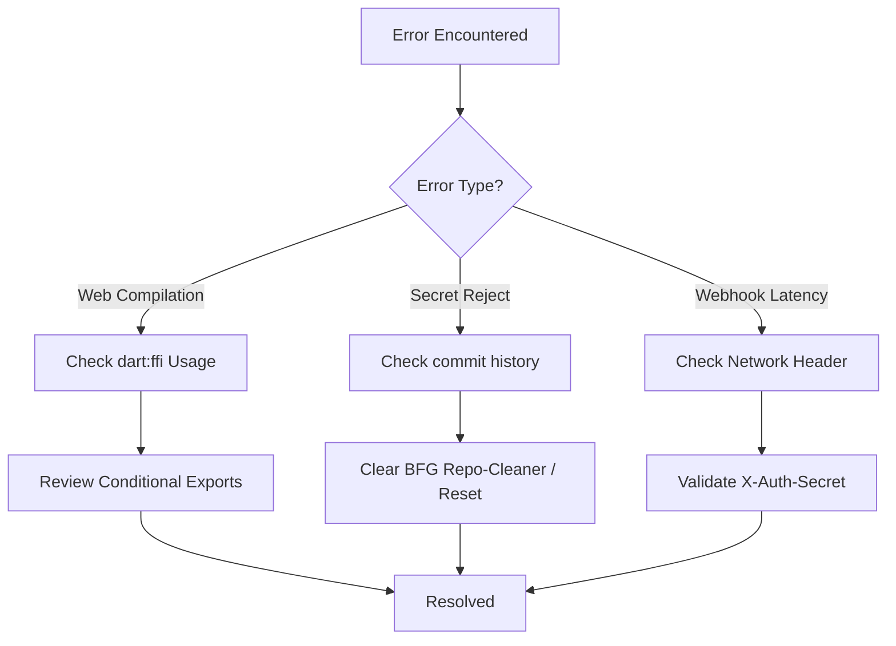

# 🛠️ The "Symptom-Resolution" Protocol (Troubleshooting)

When encountering structural blocks, dependencies issues, or AI-execution bottlenecks within EconomyApp (tAIdy), developers should reference the diagnostic tree and S.C.R.V resolutions established below.



---

#### **[Web Compilation FFI Crash]**

**Symptom:**
*When executing `flutter build web` to generate standard web pages or trigger GitHub Actions, the compiler crashes almost immediately, throwing errors similar to:*
> `Error: 'Pointer' isn't a type.` referencing `llama_cpp_dart/llama_cpp_dart.dart`.

**Root Cause:**
The `llama_cpp_dart` package uses `dart:ffi` directly to invoke native C++ binaries for executing the mathematical Large Language Models constraints. However, `dart:ffi` is explicitly isolated and unsupported within the JS/Wasm constraints of standard Flutter Web compilations. Reaching out to an unconditional `import package:llama` inside a file evaluated by the web compiler terminates the node process entirely.

**Resolution:**
*Enforce conditional abstract bindings so the Wasm compiler cannot parse the FFI logic.*
1. Locate the native execution service `lib/core/services/llm_service.dart`.
2. Extract the actual local C++ imports into a new file `llm_service_mobile.dart`.
3. Extract an empty "hollow" interface representing the endpoints into `llm_service_stub.dart`.
4. Wrap the root `llm_service.dart` with conditional compilation bounds to seamlessly proxy requests depending on the platform:
```dart
export 'llm_service_stub.dart'
  if (dart.library.io) 'llm_service_mobile.dart';
```
5. Clear caches and reboot the toolchain via your terminal: `flutter clean && flutter build web`

**Verification:**
*The web compiler will cleanly navigate past the AI layer logic. The terminal will successfully output:*
> `Wasm dry run succeeded`
> `Built build\web`

---

#### **[Git Push Push Protection Block]**

**Symptom:**
*When pushing standard updates using `git push origin main`, the terminal stops the transaction and drops the connection with:*
> `remote: error: GH013: Repository rule violations found for refs/heads/main.`
> `! [remote rejected] main -> main (push declined due to repository rule violations)`

**Root Cause:**
GitHub's built in "Secret Scanning" mechanism detected that a file tracked by git (likely `assets/credentials.json` or `pubspec.yaml`) contains active Google Gemini API Tokens or Supabase Auth Secrets.

**Resolution:**
1. Discard the current `.git` mapping to drop the local trace. Alternatively use `git reset --soft` specifically to the parent.
2. In the project root, edit the `.gitignore` safely bypassing tracking the credentials file:
   ```bash
   echo "assets/credentials.json" >> .gitignore
   ```
3. Commit cleanly:
   ```bash
   git add . && git commit -m "Chore: Initialize properly without exposed configurations"
   ```
4. Push forcibly to rewrite the branch tree:
   ```bash
   git push -u origin main -f
   ```

**Verification:**
*The terminal will bypass the security checkpoint and register the tree updates:*
> `* [new branch] main -> main`
